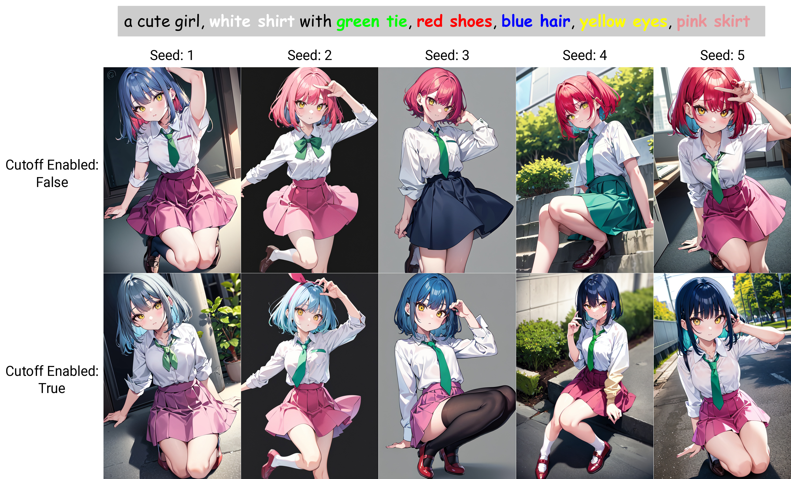
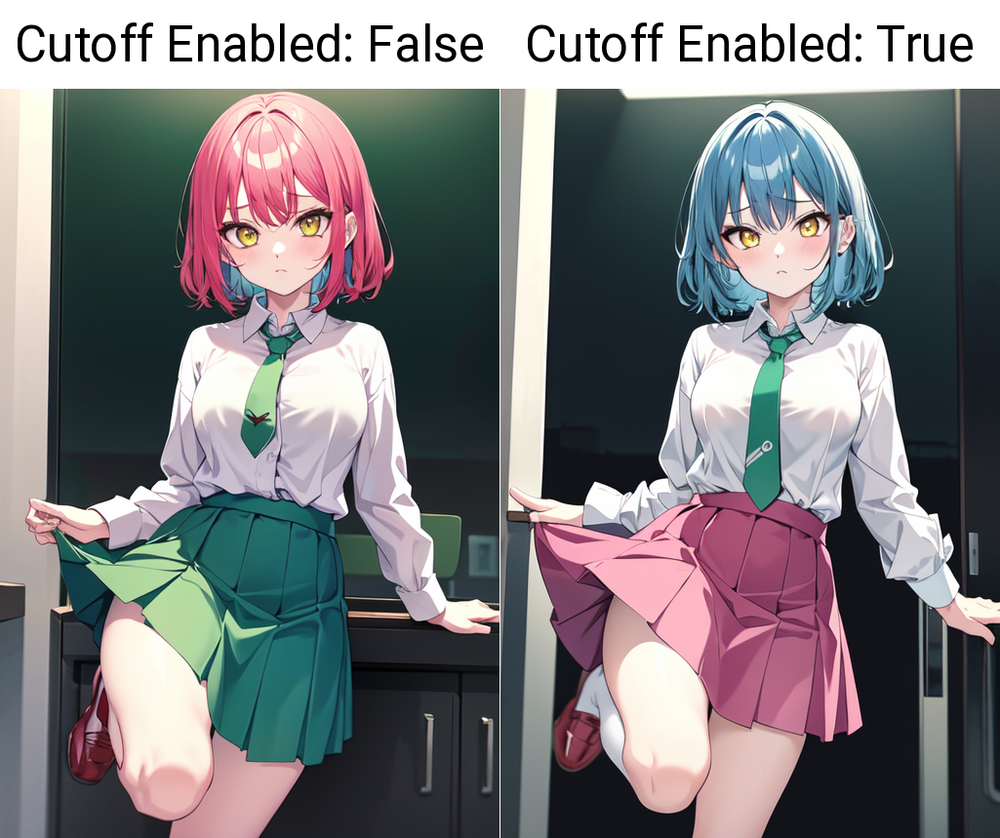

# Cutoff - Cutting Off Prompt Effect



<details>
<summary>Update Info</summary>

Upper is newer.

<dl>
<dt>20e87ce264338b824296b7559679ed1bb0bdacd7</dt>
<dd>Skip empty targets.</dd>
<dt>03bfe60162ba418e18dbaf8f1b9711fd62195ef3</dt>
<dd>Add <code>Disable for Negative prompt</code> option. Default is <code>True</code>.</dd>
<dt>f0990088fed0f5013a659cacedb194313a398860</dt>
<dd>Accept an empty prompt.</dd>
</dl>
</details>

## What is this?

This is an extension for [stable-diffusion-webui](https://github.com/AUTOMATIC1111/stable-diffusion-webui) which limits the tokens' influence scope.

## Usage

1. Select `Enabled` checkbox.
2. Input words which you want to limit scope in `Target tokens`.
3. Generate images.

## Note

If the generated image was corrupted or something like that, try to change the `Weight` value or change the interpolation method to `SLerp`. Interpolation method can be found in `Details`.

### `Details` section

<dl>
<dt>Disable for Negative prompt.</dt>
<dd>If enabled, <b>Cutoff</b> will not work for the negative prompt. Default is <code>true</code>.</dd>
<dt>Cutoff strongly.</dt>
<dd>See <a href="#how-it-works">description below</a>. Default is <code>false</code>.</dd>
<dt>Interpolation method</dt>
<dd>How "padded" and "original" vectors will be interpolated. Default is <code>Lerp</code>.</dd>
<dt>Padding token</dt>
<dd>What token will be padded instead of <code>Target tokens</code>. Default is <code>_</code> (underbar).</dd>
</dl>

## Examples

```
7th_anime_v3_A-fp16 / kl-f8-anime2 / DPM++ 2M Karras / 15 steps / 512x768
Prompt: a cute girl, white shirt with green tie, red shoes, blue hair, yellow eyes, pink skirt
Negative Prompt: (low quality, worst quality:1.4), nsfw
Target tokens: white, green, red, blue, yellow, pink
```

Sample 1.


Sample 2. (use `SLerp` for interpolation)



Sample 3.


## How it works

- [Japanese](#japanese)
- [English](#english)

or see #5 ([issues](./issues/5)).


### Japanese

プロンプトをCLIPに通して得られる (77, 768) 次元の埋め込み表現（？正式な用語は分かりません）について、
ごく単純には、77個の行ベクトルはプロンプト中の75個のトークン（＋開始トークン＋終了トークン）に対応していると考えられる。

※上図は作図上、この説明とは行と列を入れ替えて描いている。

このベクトルには単語単体の意味だけではなく、文章全体の、例えば係り結びなどの情報を集約したものが入っているはずである。

ここで `a cute girl, pink hair, red shoes` というプロンプトを考える。
普通、こういったプロンプトの意図は

1. `pink` は `hair` だけに係っており `shoes` には係っていない。
2. 同様に `red` も `hair` には係っていない。
3. `a cute girl` は全体に係っていて欲しい。`hair` や `shoes` は女の子に合うものが出て欲しい。

……というもののはずである。

しかしながら、[EvViz2](https://github.com/hnmr293/sd-webui-evviz2) などでトークン間の関係を見ると、そううまくはいっていないことが多い。
つまり、`shoes` の位置のベクトルに `pink` の影響が出てしまっていたりする。

一方で上述の通り `a cute girl` の影響は乗っていて欲しいわけで、どうにかして、特定のトークンの影響を取り除けるようにしたい。

この拡張では、指定されたトークンを *padding token* に書き換えることでそれを実現している。

たとえば `red shoes` の部分に対応して `a cute girl, _ hair, red shoes` というプロンプトを生成する。`red` と `shoes` に対応する位置のベクトルをここから生成したもので上書きしてやることで、`pink` の影響を除外している。

これを `pink` の側から見ると、自分の影響が `pink hair` の範囲内に制限されているように見える。What is this? の "limits the tokens' influence scope" はそういう意味。

ところで `a cute girl` の方は、`pink hair, red shoes` の影響を受けていてもいいし受けなくてもいいような気がする。
そこでこの拡張では、こういうどちらでもいいプロンプトに対して

1. `a cute girl, pink hair, red shoes`
2. `a cute girl, _ hair, _ shoes`

のどちらを適用するか選べるようにしている。`Details` の `Cutoff strongly` がそれで、オフのとき1.を、オンのとき2.を、それぞれ選ぶようになっている。
元絵に近いのが出るのはオフのとき。デフォルトもこちらにしてある。

### English

NB. The following text is a translation of the Japanese text above by [DeepL](https://www.deepl.com/translator).

For the (77, 768) dimensional embedded representation (I don't know the formal terminology), one could simply assume that the 77 row vectors correspond to the 75 tokens (+ start token and end token) in the prompt.

Note: The above figure is drawn with the rows and columns interchanged from this explanation.

This vector should contain not only the meanings of individual words, but also the aggregate information of the whole sentence, for example, the connection between words.

Consider the prompt `a cute girl, pink hair, red shoes`. Normally, the intent of such a prompt would be

- `pink` is only for `hair`, not `shoes`.
- Similarly, `red` does not refer to `hair`.
- We want `a cute girl` to be about the whole thing, and we want the `hair` and `shoes` to match the girl.

However, when we look at the relationship between tokens in [EvViz2](https://github.com/hnmr293/sd-webui-evviz2) and other tools, we see that it is not always that way. In other words, the position vector of the `shoes` may be affected by `pink`.

On the other hand, as mentioned above, we want the influence of `a cute girl` to be present, so we want to be able to somehow remove the influence of a specific token.

This extension achieves this by rewriting the specified tokens as a *padding token*.

For example, for the `red shoes` part, we generate the prompt `a cute girl, _ hair, red shoes`, and by overwriting the position vectors corresponding to `red` and `shoes` with those generated from this prompt, we remove the influence of `pink`.

From `pink`'s point of view, it appears that its influence is limited to the `pink hair`'s scope.

By the way, `a cute girl` may or may not be influenced by `pink hair` and `red shoes`. So, in this extension, for such a prompt that can be either

1. `a cute girl, pink hair, red shoes`
2. `a cute girl, _ hair, _ shoes`

The `Cutoff strongly` in the `Details` section allows you to select 1 when it is off and 2 when it is on. The one that comes out closer to the original image is "off". The default is also set this way.
